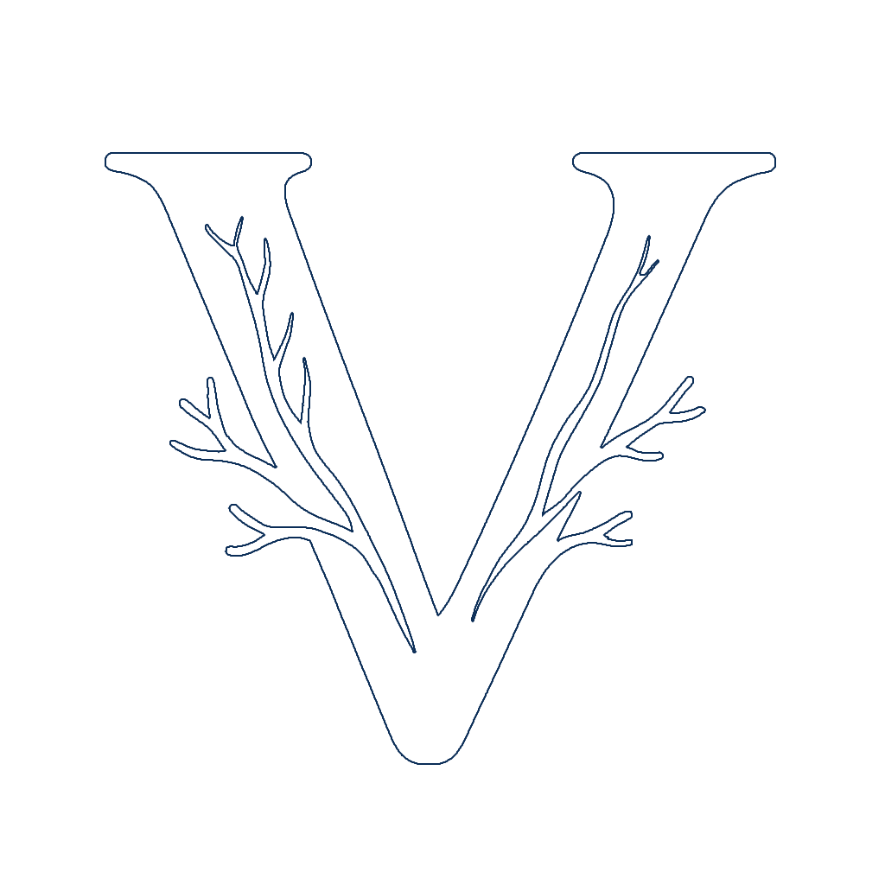

<div align="center">
  
</div>

# Vtrack - An Open-Source Tool for Blood Vessel and Occlusion Annotation

A React-based web application for annotating blood vessels and occlusions in medical images. Supports keypoints, skeleton connections, and bounding boxes.
The application is already deployed and accessible at: **https://vascu-track.chu-reims.fr/**
## Features

- **Keypoint Annotation** - Mark anatomical points along vessels with labels
- **Skeleton Connections** - Draw lines between keypoints to trace vessel paths
- **Bounding Boxes** - Mark regions (Occlusion, Hide Region)
- **Contrast Injection Site Classification** - Classify injection sites
- **Multi-page Support** - Navigate through image sequences
- **Export** - Save all annotations as JSON
- **Bilingual Instructions** - French/English tutorial with GIFs


## Quick Start

### Option 1: Local Development (npm)

**Requirements:** Node.js 18+

```bash
# Install dependencies
npm install

# Start development server
npm run dev

# Open in browser
# http://localhost:5173
```

### Option 2: Docker

**Requirements:** Docker and Docker Compose

```bash
# Build and run
docker-compose up

# Open in browser
# http://localhost:80
```

## Application Interface

<div align="center">
  
</div>


## Usage

1. **Load Images** - Drag & drop or click to upload DICOM/standard images
2. **Select Annotation Mode**
   - Vessels: Choose from Cranial/Abdominal vessels
   - Skeleton: Connect keypoints with lines
   - Bounding Boxes: Mark regions
   - Contrast Injection Site Classification: Classify injection sites
3. **Annotate** - Click on image to place keypoints, connect with skeletons, or draw boxes
4. **Navigate** - Use Previous/Next to move between images
5. **Save** - Click Save to export all annotations as JSON

### Keyboard Shortcuts

- **Delete** - Create independent keypoint (no parent connection)
- **Mouse Wheel** - Zoom in/out
- **Right Click + Drag** - Pan image
